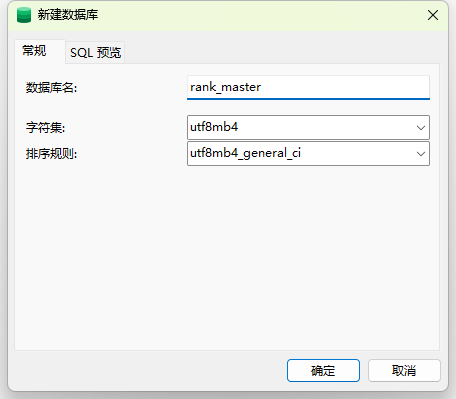
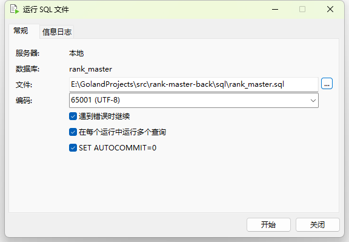

# 开发手册
1. 编写API文档
```api
type (
    HelloReq{
        req string `json:"req"` 
    }
    HelloResp{
        resp string `json:"resp"`
    }
)


service app {
    @doc "hello"
    @handler Hello
    post /hello (HelloReq) returns (HelloResp)
}
```

2. 生成API代码
```shell
make api
```
3. 实现逻辑
```go
func (l *HelloLogic) Hello(req *types.HelloReq) (resp *types.HelloResp, err error) {
	// TODO: 实现业务逻辑
	return resp, nil
}
```

# 生成swagger文档
```shell
make swagger
```

# 启动服务
## mysql
1. 创建rank_master数据库



2. 运行sql文件

